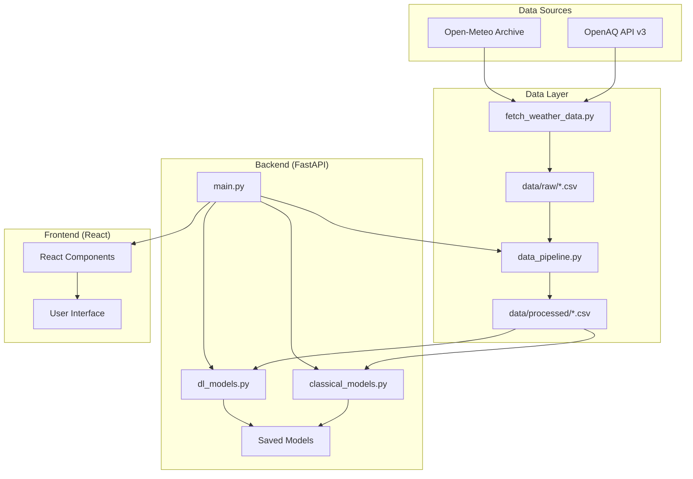

# ShuddhVayu - Technical Documentation & Developer Manual

This document provides a comprehensive deep-dive into the ShuddhVayu codebase. It is intended for developers who wish to understand the internal workings, extend the forecasting engine, or modify the application.

---

## 1. System Architecture

The application follows a modern full-stack architecture with a React frontend, FastAPI backend, and modular ML pipeline.



---

## 2. Data Pipeline (`backend/app/services/data_pipeline.py`)

### Overview

The data pipeline handles ETL (Extract-Transform-Load), data cleaning, and feature engineering.

### Key Functions

#### `process_data(city: str)`

Main pipeline function that:

1. **Data Loading**: Loads city-specific files (`{city}_aqi.csv`, `{city}_weather.csv`) or combined file
2. **Duplicate Column Consolidation**: Merges sensor duplicates (e.g., `PM2.5` + `PM2.5.1`)
3. **Missing Value Imputation**: Linear interpolation with bidirectional fill
4. **AQI Calculation**: Computes AQI using CPCB breakpoints
5. **Feature Engineering**: Date features, lag features (1-7 days), rolling statistics
6. **Output**: Saves cleaned data and feature-engineered dataset

#### `consolidate_duplicate_columns(df)`

Handles pandas-renamed duplicate columns:
```python
# When CSV has: PM2.5,PM2.5 (duplicate headers)
# Pandas creates: PM2.5, PM2.5.1
# This function merges them by taking mean of non-null values
```

#### `get_aqi_cpcb(row)`

Calculates AQI using Central Pollution Control Board (CPCB) standards:

| Pollutant | Units | AQI Breakpoints |
|-----------|-------|-----------------|
| PM2.5 | µg/m³ | 0-30 (Good), 31-60 (Satisfactory), 61-90 (Moderate), 91-120 (Poor) |
| PM10 | µg/m³ | 0-50 (Good), 51-100 (Satisfactory), 101-250 (Moderate) |
| NO2 | µg/m³ | 0-40 (Good), 41-80 (Satisfactory), 81-180 (Moderate) |
| CO | mg/m³ | 0-1 (Good), 1.1-2 (Satisfactory), 2.1-10 (Moderate) |
| SO2 | µg/m³ | 0-40 (Good), 41-80 (Satisfactory), 81-380 (Moderate) |
| O3 | µg/m³ | 0-50 (Good), 51-100 (Satisfactory), 101-168 (Moderate) |

**Final AQI = max(all sub-indices)**

### Data Quality Handling

| Issue | Solution |
|-------|----------|
| Duplicate sensor columns | `consolidate_duplicate_columns()` merges by mean |
| CO unit mismatch | Auto-convert µg/m³ → mg/m³ if value > 100 |
| Missing pollutant values | Linear interpolation, bidirectional fill |
| Missing AQI | Calculate from pollutants using CPCB formula |

---

## 3. Data Fetching (`scripts/fetch_weather_data.py`)

### OpenAQ API v3 Integration

Fetches pollutant data from nearby monitoring stations:

```python
# Workflow:
# 1. Find locations near city coordinates (25km radius)
# 2. Get sensors for the location
# 3. Fetch daily historical data for each sensor
# 4. Merge by date, standardize column names
```

#### Pollutant Name Mapping

```python
PARAM_MAP = {
    "pm25": "PM2.5", "pm2.5": "PM2.5",
    "pm10": "PM10",
    "no2": "NO2",
    "so2": "SO2",
    "co": "CO",
    "o3": "O3",
    "no": "NO"
}
```

### Open-Meteo Weather API

Free historical weather data:
- `temperature_2m_max`, `temperature_2m_min`, `temperature_2m_mean`
- `precipitation_sum`, `rain_sum`
- `wind_speed_10m_max`, `wind_direction_10m_dominant`
- `shortwave_radiation_sum`

---

## 4. ML Models

### Classical Models (`backend/app/services/classical_models.py`)

| Model | Description | Parameters |
|-------|-------------|------------|
| Linear Regression | Baseline model | Default sklearn params |
| SVR | Support Vector Regressor | RBF kernel |
| XGBoost | Gradient Boosting | n_estimators=1000, learning_rate=0.05, early_stopping=50 |

#### Training Workflow

```python
def train_classical_model(df, target_pollutant, model_wrapper, model_name, save_path):
    # 1. Split data (90% train, 10% validation)
    # 2. Train model wrapper
    # 3. Calculate MAE
    # 4. Save model + metadata using joblib
```

#### Dynamic Prediction (Multi-Step Forecasting)

```python
def dynamic_predict(model_wrapper, last_known_data, future_dates, target_pollutant):
    # Recursive forecasting:
    # - Predict day T+1
    # - Use T+1 prediction to update lag features
    # - Predict T+2... T+7
```

### Deep Learning Models (`backend/app/services/dl_models.py`)

| Model | Architecture |
|-------|--------------|
| ANN | Dense(64, relu) → Dense(32, relu) → Output(1) |
| LSTM | LSTM(50, relu) → Dense(25, relu) → Output(1) |

---

## 5. API Reference (`backend/app/main.py`)

### Core Endpoints

| Endpoint | Method | Description |
|----------|--------|-------------|
| `GET /health` | GET | Health check |
| `GET /api/cities` | GET | List available cities |
| `GET /api/trends/{city}` | GET | Historical pollutant trends |
| `GET /api/distribution/{city}` | GET | Pollutant distribution data |

### Data Operations Endpoints

| Endpoint | Method | Description |
|----------|--------|-------------|
| `POST /api/fetch-weather` | POST | Fetch external data (weather + AQI) |
| `POST /api/process-features` | POST | Run data pipeline for city |

### Model Endpoints

| Endpoint | Method | Description |
|----------|--------|-------------|
| `POST /api/train` | POST | Train ML model |
| `POST /api/predict` | POST | Generate forecast |

---

## 6. Frontend Structure (`frontend/`)

### Key Components

| Component | Purpose |
|-----------|---------|
| `DataConsole.tsx` | Interactive data management interface for fetching/processing |
| `DataPipelineStatus.tsx` | Real-time monitoring of pipeline execution |
| `ForecastViewer.tsx` | Interactive 7-day forecast visualization |
| `Header.tsx` | Navigation and app branding |
| `HealthAnalysis.tsx` | LLM-powered health recommendations display |
| `KPIGrid.tsx` | Key performance indicators dashboard |
| `ModelDashboard.tsx` | Model training, status, and comparison |
| `PolicyPanel.tsx` | Government policy recommendations UI |
| `Sidebar.tsx` | Navigation menu |

---

## 7. LLM-Powered Features (`backend/app/services/prompts.py`)

### Health Analysis (Groq API)

Uses Llama 3.3 to generate personalized health recommendations based on AQI data.

**Input:**
- Current AQI value
- Predicted AQI (next 24h)
- Dominant pollutant

**Output (JSON):**
```json
{
  "summary": "Air quality status description",
  "risk_level": "Low/Moderate/High/Severe",
  "recommendations": {
    "children": "...",
    "seniors": "...",
    "athletes": "..."
  }
}
```

### Policy Engine (Groq API)

Generates government-level policy roadmaps for pollution reduction.

**Input:**
- City name
- Current AQI
- Dominant pollutant

**Output (JSON):**
```json
{
  "short_term": {
    "duration": "3 Months",
    "focus": "Immediate mitigation",
    "actions": ["Action 1", "Action 2"],
    "projected_impact": "10-15% reduction"
  },
  "medium_term": { ... },
  "long_term": { ... }
}
```

---

## 8. Extending the Project

### Adding a New Model

1. **Define the Class** in `classical_models.py` or `dl_models.py`:
   ```python
   class NewModel:
       def train(self, X_train, y_train, X_val=None, y_val=None): ...
       def predict(self, X): ...
   ```

2. **Register it** in the models dictionary:
   ```python
   CLASSICAL_MODELS["New Model"] = NewModel()
   ```

3. **UI auto-updates** from the dictionary keys.

### Adding a New City

1. **Add to `CITY_CONFIG`** in `fetch_weather_data.py`:
   ```python
   "NewCity": {
       "coords": (lat, lon),
       "state": "Gujarat"
   }
   ```

2. **Fetch data**:
   ```bash
   python scripts/fetch_weather_data.py --city NewCity --start_date 2023-01-01
   ```

3. **Run pipeline**:
   ```python
   from backend.app.services.data_pipeline import process_data
   process_data('NewCity')
   ```

### Adding a New Pollutant

1. Ensure the pollutant is fetched by `fetch_weather_data.py`
2. Add to `pollutant_cols` list in `data_pipeline.py`
3. Add CPCB breakpoints in `get_aqi_cpcb()` if needed

---

## 8. Troubleshooting

### Common Issues

| Issue | Solution |
|-------|----------|
| "No data files found" | Run `fetch_weather_data.py` first |
| AQI showing 500 | Check if pollutant values are missing or out of range |
| Duplicate columns in CSV | Pipeline auto-consolidates; check logs |
| CO values too high | Pipeline auto-converts µg/m³ → mg/m³ |

### Verification Commands

```bash
# Check December 2025 AQI values
tail -10 data/processed/ahmedabad_features.csv | cut -d',' -f1,30

# View raw data structure
head -3 data/raw/ahmedabad_aqi.csv

# Run pipeline with debug output
python -c "from backend.app.services.data_pipeline import process_data; process_data('Ahmedabad')"
```
